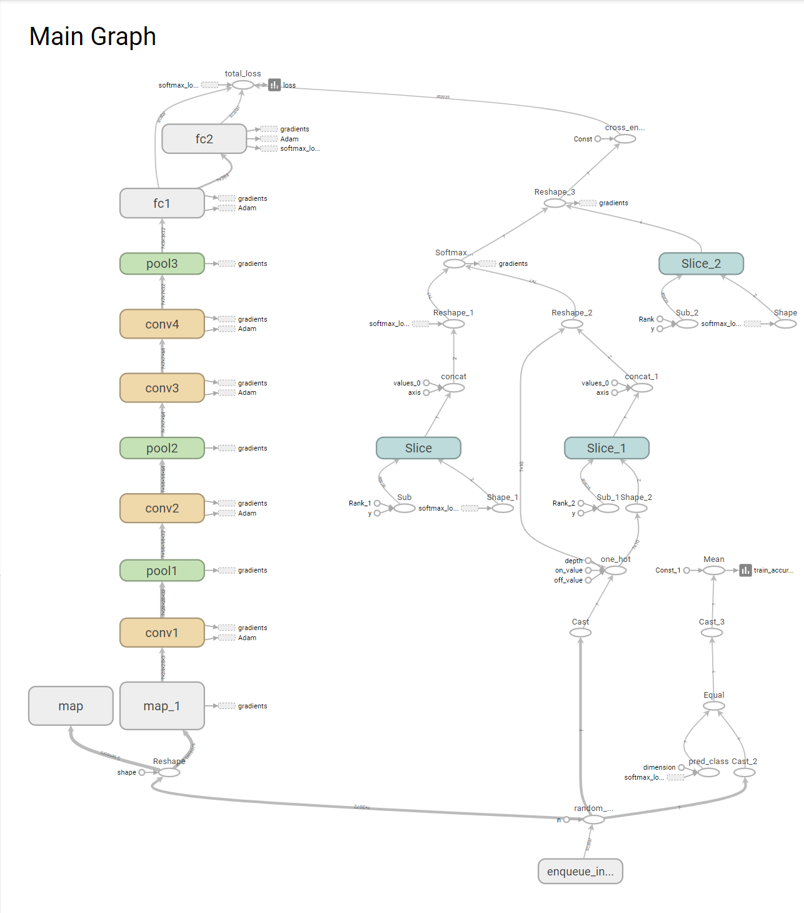

# CIFAR-10
image classification on CIFAR-10 datatsets using CNN
1. 9-layer CNN - test accuracy 67%

2. inception-v3 model, recomputing the bottlenecks and retraining the last layer - test accuracy 81.5%

```
lib -- all the graphs 
       latex raw code to get the final report
       
doc -- python notebook contain the cnn model code
       the final report(pdf)
       transfer-learning-project.py contains functions to facilitate fine-tuning an inception mode
```
Python version dataset can be downloaded at https://www.cs.toronto.edu/~kriz/cifar.html
